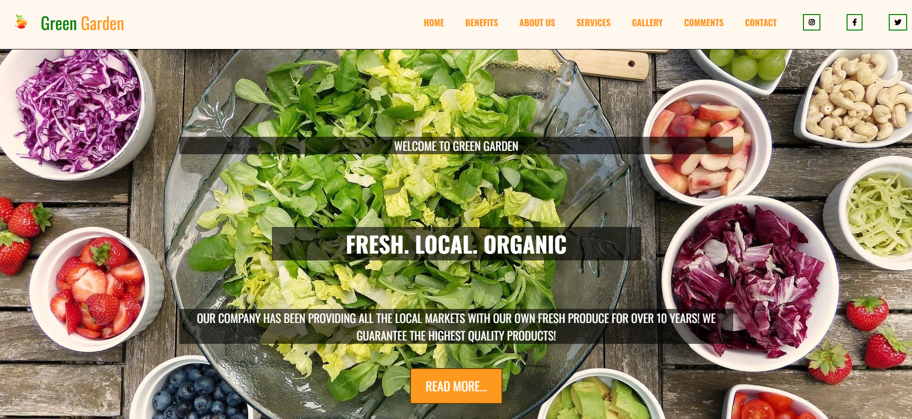
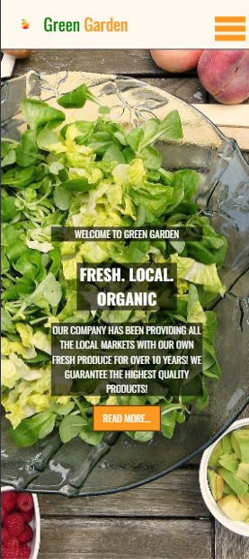

# Organic Website 🌿

A modern responsive organic products website built with **HTML, CSS and JavaScript**.

This project was created to practice building a multi-section landing page with a clean layout, responsive design, and interactive elements using vanilla JavaScript.

---

# Live Demo

👉 https://sebastianjuszczynski.github.io/organic-website/

---

# Preview




---

# Project Overview

The goal of this project was to practice building a realistic website layout similar to a modern organic products or healthy food brand website.

During development I focused on:

- building a structured multi-section layout
- creating reusable UI sections
- styling components with CSS
- adding interactivity with JavaScript
- integrating a gallery library
- organizing project files clearly

---

# Features

- Responsive website layout
- Modern organic / eco website design
- Image gallery implemented using a JavaScript library
- Multiple sections (hero, products, gallery, contact etc.)
- Smooth navigation
- Clean and modern UI

---

# Tech Stack

### Frontend

<p>

</p>

### Libraries

- JavaScript gallery library (for image gallery functionality)

### Tools

<p>

</p>

---

# Installation

Clone the repository

```bash
git clone https://github.com/sebastianjuszczynski/organic-website.git
```

Navigate to the project directory

```bash
cd organic-website
```

Open the project

Simply open the `index.html` file in your browser.

---

# What I Learned

While building this project I improved my understanding of:

- building responsive website layouts
- structuring HTML sections
- styling layouts using CSS
- working with external JavaScript libraries
- creating image galleries
- organizing frontend projects

---

# Possible Future Improvements

Possible improvements for this project include:

- adding animations
- improving mobile navigation
- adding a product filtering system
- integrating a backend or CMS
- improving accessibility

---

# Author

Sebastian Juszczyński

Frontend developer focused on building modern web applications with **JavaScript and React**.

GitHub  
https://github.com/sebastianjuszczynski
